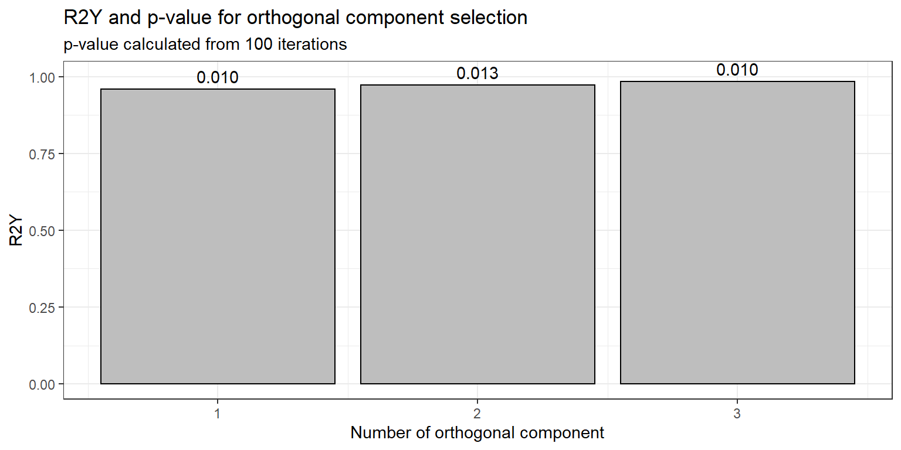
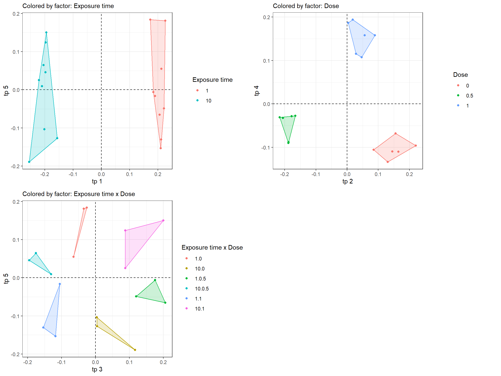
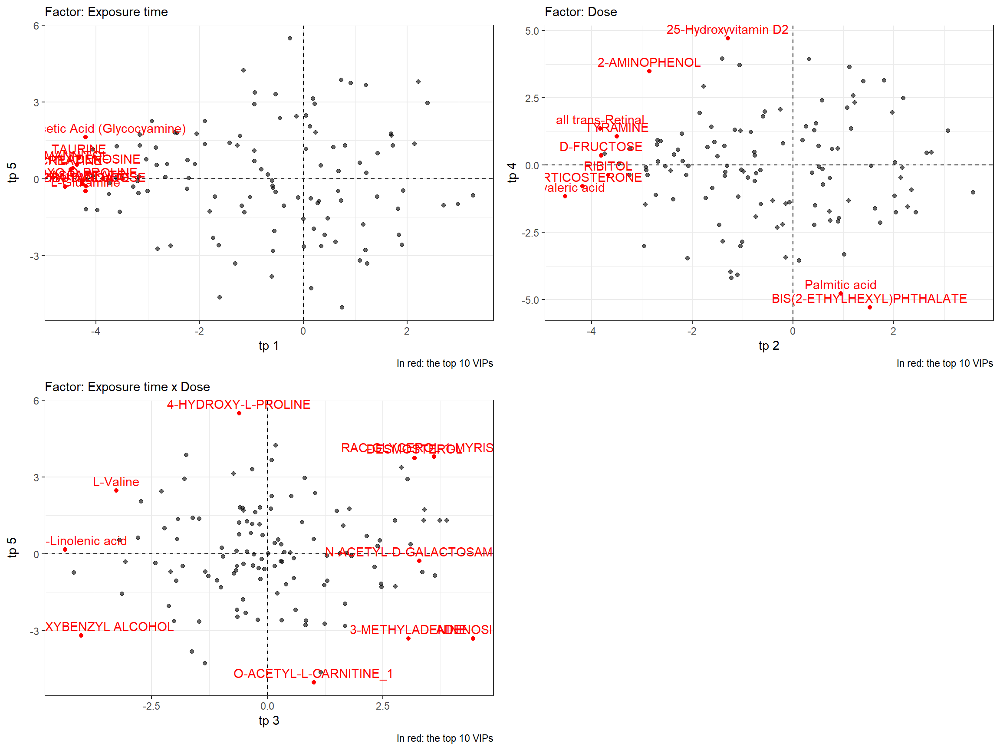
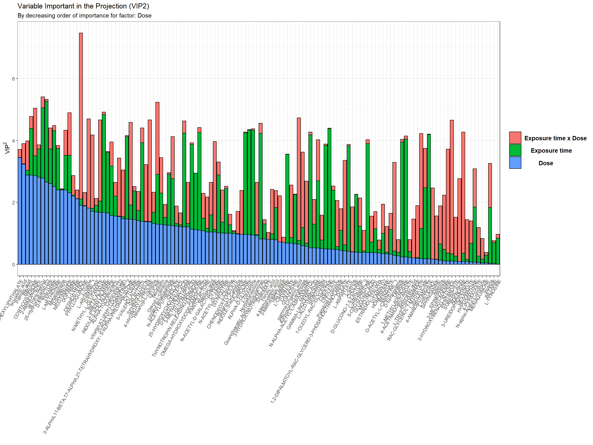
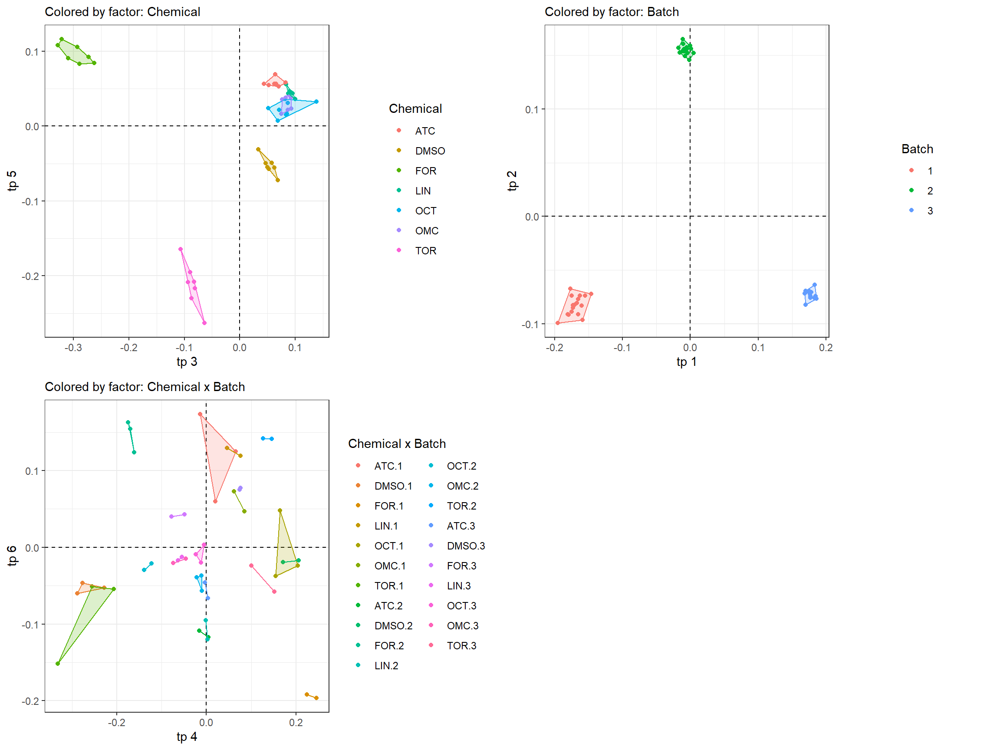
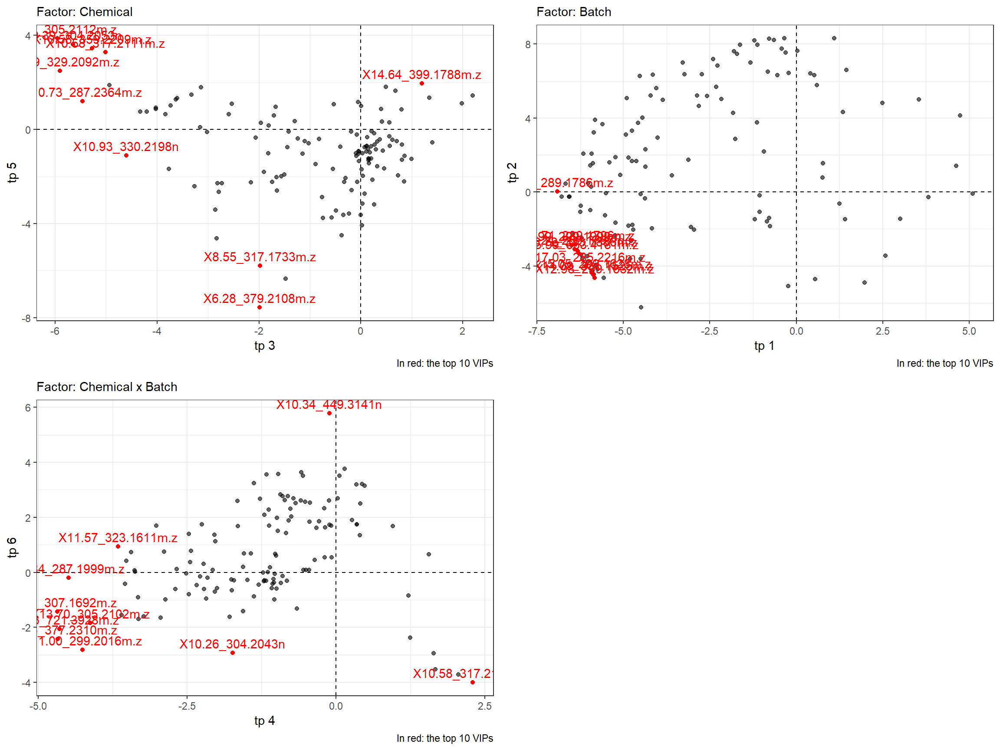
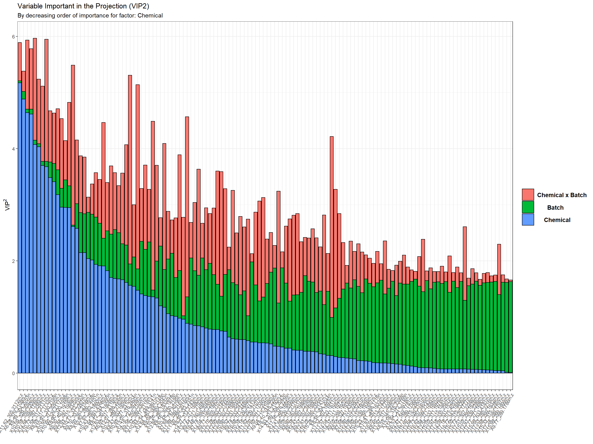

## Overview

The `rAMOPLS` package is a tool for helping you to extract relevant
information from multivariate experiments with multiple factors. It
provides simple functions to perform and assess an **A**nova
**M**ultiblock **O**rthogonal **P**artial **L**east **S**quare analysis
**(AMOPLS)** as described by Boccard and Rudaz (2016) with the specific
calculation of **V**ariable **I**mportant in the **P**rojection
**(VIP²)** described by González-Ruiz et al. (2017). Since most
biological experiments are unbalanced due to a wide range of reasons,
the method of stratified subsampling described by Boccard et al. (2019)
has also been implemented here.

Most biologist need to extract relevant information (treatment,
tissular, organs, genotype, …) from noisy and highly uncontrollable
experiments. Most of us will try to use a design-of-experiment to assess
any factors which can influence the response (wanted and unwanted
variations). But then the tools to assess the effect of each factor and
their interactions in multivariate experiments are not widely available.
The AMOPLS methods combine ANOVA and k-OPLS (Bylesjö et al. (2008))
statistical methods to address these problems and provide easy-to-use
diagnostics parameters to evaluate the effects.

## Getting started

### Installing

`rAMOPLS` can be installed using one of the following methods:

  - Directly from a remote location using `remotes` or `devtools`
    packages  
  - By cloning or downloading this project and performing an
    installation from source (see `utils::install.packages()`)

The AMOPLS method depends on the kopls package which is available
[here](http://kopls.sourceforge.net/index.shtml). A copy of the package
sources is implemented inside the `rAMOPLS` and can be installed with
`rAMOPLS::install_kopls()`.

### Calculate an AMOPLS model

The single `run_AMOPLS()` function is a wrapper to perform AMOPLS model
with permutations and return loadings, scores, variances, saliences and
statistics. It take as input two table (as matrix, data.frame or
data.table) with the first column being unique identifier for rows and
the column names from samplemetadata to study (factors):

  - `datamatrix`: with observations as rows and measurments as columns  
  - `samplemetadata`: with observations as rows and descriptor as
    columns (sample groups)  
  - `factor_names`: Column names of samplemetadata with factor to
    consider

Exemple on `data_Ruiz2017` dataset on “Exposure time” and “Dose” with
level 1 interaction and 100 permutations:

``` r
require(rAMOPLS)
result <- run_AMOPLS(datamatrix = data_Ruiz2017$datamatrix,
                     samplemetadata = data_Ruiz2017$samplemetadata, 
                     factor_names = c("Exposure time", "Dose"))
```

The following arguments are optional *(default value)*:

  - `interaction_level` *(1)*: Order of interactions to consider (0 for
    main effect and 1 for first order interaction: Fac\_A, Fac\_B and
    Fac\_A x Fac\_B)  
  - `scaling` *(T)*: Logical to perform a variance scaling of the
    datamatrix  
  - `nb_perm` *(100)*: Number of permutation to test for each effect
    (default to 100)  
  - `nb_compo_orthos` *(1:3)*: Number of orthogonal component to
    consider (1:5 to test 1 to 5)  
  - `parallel` *(FALSE)*: If TRUE or a number (y), run permutations in
    parallel one y core using
    [future](https://cran.r-project.org/web/packages/future/index.html)
    and
    [furrr](https://cran.r-project.org/web/packages/furrr/index.html)
    for progress bar

### Choose the optimal number of orthogonal component

The optimal numnber parsimony principle is applied in the case of
equally performing models with a different number of orthogonal
components (Boccard and Rudaz (2016)): The significative model with the
smallest number of orthogonal component is to be choosen.

In this example the first model is already significant and should be
choosen.

``` r
fun_plot_ortho(result)
```



``` r
result_optimal <- result$orthoNb_1
```

### Summary statistics

All graphical output use `ggplot2` and can be customized according to
ggplot2 nomenclature.

  - Summary statistics:

<!-- end list -->

``` r
fun_get_summary(result_optimal) %>% knitr::kable(digits = 3, align = 'c')
```

|  Effect   |     Effect Name      |  RSS  |  RSR  | RSS p-value | RSR p-value | R2Y p-value | PermNb |  Tp1  |  Tp2  |  Tp3  |  Tp4  |  Tp5  |  To1  |
| :-------: | :------------------: | :---: | :---: | :---------: | :---------: | :---------: | :----: | :---: | :---: | :---: | :---: | :---: | :---: |
|     1     |    Exposure time     | 0.230 | 1.741 |    0.01     |    0.01     |    0.01     |  100   | 0.993 | 0.015 | 0.039 | 0.031 | 0.072 | 0.171 |
|     2     |         Dose         | 0.120 | 1.164 |    1.00     |    1.00     |    0.01     |  100   | 0.002 | 0.933 | 0.059 | 0.864 | 0.108 | 0.256 |
|    12     | Exposure time x Dose | 0.087 | 1.079 |    1.00     |    1.00     |    0.01     |  100   | 0.002 | 0.025 | 0.833 | 0.050 | 0.693 | 0.276 |
| residuals |      residuals       | 0.562 | 1.000 |     NA      |     NA      |     NA      |   NA   | 0.002 | 0.027 | 0.068 | 0.054 | 0.126 | 0.298 |

  - Optimal score plot:

<!-- end list -->

``` r
fun_plot_optimal_scores(result_optimal)
```



  - Optimal loading plot:

<!-- end list -->

``` r
fun_plot_optimal_loadings(result_optimal)
```



  - VIP² as described in González-Ruiz et al. (2017):

<!-- end list -->

``` r
fun_plot_VIPs(result_optimal, "Dose")
```



## Stratified subsampling for unbalanced data

Unbalanced experimental designs involve non-orthogonal ANOVA submatrices
which can alter effects interpretation (Drotleff and Lämmerhofer
(2019)). To cope with unbalanced design, the most strategy is to
resample the dataset to get a balanced design by either:

  - **oversampling:** complete the group with missing observations by
    adding existing ones.  
  - **undersampling:** delete observations in each group to align with n
    in the smallest group.

Since oversampling may alter variance decomposition by incorporating
identical samples to the model, Boccard et al. (2019) used a strategy
based on undersampling strategy. To cope with minimized dataset (and
therfore deleted observation), the subsampling is randomly performed a
high number of times (1000s) and the models are combined using
ensemble-based estimates from balanced models (involving median
calculation of each parameters obtained from AMOPLS).

This strategy as been implemented in rAMOPLS and is automatically
triggered if the input dataset are unbalanced. The number of subsampling
steps can be customized with the `subsampling` parameter.

Example on the same dataset as Boccard et al. (2019):

``` r
require(rAMOPLS)
result_unbalanced <- run_AMOPLS(
  datamatrix = data_Boccard2019$datamatrix,
  samplemetadata = data_Boccard2019$samplemetadata, 
  factor_names = c("Chemical", "Batch"), 
  nb_perm = 100,
  subsampling = 10,
  parallel = 3)
result_optimal <- result_unbalanced[[1]]
```

  - Summary statistics:

<!-- end list -->

``` r
fun_get_summary(result_optimal) %>% knitr::kable(digits = 3, align = 'c')
```

|  Effect   |   Effect Name    |  RSS  |  RSR   | RSS p-value | RSR p-value | R2Y p-value | PermNb |  Tp1  |  Tp2  |  Tp3  |  Tp4  |  Tp5  |  Tp6  |  Tp7  |  Tp8  |  Tp9  | Tp10  | Tp11  | Tp12  | Tp13  | Tp14  | Tp15  | Tp16  | Tp17  | Tp18  | Tp19  | Tp20  |  To1  |
| :-------: | :--------------: | :---: | :----: | :---------: | :---------: | :---------: | :----: | :---: | :---: | :---: | :---: | :---: | :---: | :---: | :---: | :---: | :---: | :---: | :---: | :---: | :---: | :---: | :---: | :---: | :---: | :---: | :---: | :---: |
|     1     |     Chemical     | 0.165 | 4.075  |    0.01     |    0.01     |    0.01     |  100   | 0.000 | 0.000 | 0.998 | 0.001 | 0.986 | 0.003 | 0.971 | 0.021 | 0.032 | 0.902 | 0.045 | 0.682 | 0.057 | 0.054 | 0.065 | 0.105 | 0.357 | 0.112 | 0.109 | 0.118 | 0.154 |
|     2     |      Batch       | 0.611 | 17.463 |    0.01     |    0.01     |    0.01     |  100   | 0.999 | 0.998 | 0.000 | 0.000 | 0.000 | 0.000 | 0.001 | 0.005 | 0.007 | 0.004 | 0.011 | 0.014 | 0.013 | 0.013 | 0.015 | 0.024 | 0.027 | 0.026 | 0.025 | 0.028 | 0.036 |
|    12     | Chemical x Batch | 0.157 | 3.410  |    0.01     |    0.01     |    0.01     |  100   | 0.000 | 0.000 | 0.000 | 0.995 | 0.003 | 0.984 | 0.006 | 0.886 | 0.853 | 0.022 | 0.772 | 0.076 | 0.704 | 0.688 | 0.644 | 0.484 | 0.141 | 0.410 | 0.414 | 0.372 | 0.184 |
| residuals |    residuals     | 0.065 | 1.000  |     NA      |     NA      |     NA      |   NA   | 0.001 | 0.001 | 0.002 | 0.003 | 0.006 | 0.006 | 0.022 | 0.087 | 0.108 | 0.069 | 0.168 | 0.235 | 0.229 | 0.236 | 0.279 | 0.379 | 0.467 | 0.447 | 0.441 | 0.469 | 0.627 |

  - Optimal score plot:

<!-- end list -->

``` r
fun_plot_optimal_scores(result_optimal)
```



  - Optimal loading plot:

<!-- end list -->

``` r
fun_plot_optimal_loadings(result_optimal)
```



  - VIP² as described in González-Ruiz et al. (2017):

<!-- end list -->

``` r
fun_plot_VIPs(result_optimal, "Chemical")
```



## Model interpretation

The first step is to ensure the consitency of the ANOVA partitionning,
the number of orthogonal components to include in the model and the
reliability of the observed effects using the following indices:

  - **ANOVA consistency** by using the **R**esidual **S**tructure
    **R**atio **(RSR)** associated to each effect. This indicator
    represents the data structure associated to each effect in regard of
    the residual. Therefore it is an effect-to-residual ratio that
    reflects the reliability of each effect. Close or equal to 1 mean no
    effect.  
  - **Reliability of the observed effects** is assessed by checking the
    Realtive Sum of Square (RSS).  
  - **Optimal number of orthogonal components** using R²Y and its
    associated p-value. In the case of equally performing models, the
    parsimony principle is applied and the least of significative
    orthogonal component number is choosen. The R²Y indice represents
    the explained variation of Y An R²Y parameter closer to 1 means a
    stronger models (more of the predicted variations are captured by
    the model).

> Random experimental designs are expected to produce low R2Y values (no
> model) and RSR indices close to one (no effect). When both the AMOPLS
> model R2Y and individual RSR indices are deemed significant,
> biochemical information can be extracted from the loadings of the
> predictive components (Boccard and Rudaz (2016)).

## To learn more

You can find more detailled explanation on AMOPLS in the references
provided at the end of this page, starting by the original article from
Boccard et al. (2010).

## Datasets provided

The package is preloaded with the following datasets to test and compare
the functionalities with published articles:

  - `liver.toxicity`: Microarray of gene expression from Fisher rats
    after acetaminophen exposition Bushel et al. (2007) and used in
    Boccard and Rudaz (2016)  
  - `data_Boccard2016`: Metabolomic profiles of *A. thaliana* leaves
    from Boccard et al. (2010) used in Boccard and Rudaz (2016)  
  - `data_Ruiz2017`: Metabolomic profiles of human neural cells from
    González-Ruiz et al. (2017)  
  - `data_Boccard2019`: Metabolomic profiles used to demonstrate the
    subsampling strategy in Boccard et al. (2019)

## References

<div id="refs" class="references">

<div id="ref-Boccard2010">

**Boccard J, Kalousis A, Hilario M, Lantéri P, Hanafi M, Mazerolles G,
Wolfender JL, Carrupt PA, Rudaz S** (2010) Standard machine learning
algorithms applied to UPLC-TOF/MS metabolic fingerprinting for the
discovery of wound biomarkers in Arabidopsis thaliana. Chemometrics and
Intelligent Laboratory Systems **104**: 20–27

</div>

<div id="ref-Boccard2016">

**Boccard J, Rudaz S** (2016) Exploring Omics data from designed
experiments using analysis of variance multiblock Orthogonal Partial
Least Squares. Analytica Chimica Acta **920**: 18–28

</div>

<div id="ref-Boccard2019">

**Boccard J, Tonoli D, Strajhar P, Jeanneret F, Odermatt A, Rudaz S**
(2019) Removal of batch effects using stratified subsampling of
metabolomic data for in vitro endocrine disruptors screening. Talanta
**195**: 77–86

</div>

<div id="ref-Bushel2007">

**Bushel PR, Wolfinger RD, Gibson G** (2007) Simultaneous clustering of
gene expression data with clinical chemistry and pathological
evaluations reveals phenotypic prototypes. BMC Systems Biology. doi:
[10.1186/1752-0509-1-15](https://doi.org/10.1186/1752-0509-1-15)

</div>

<div id="ref-Bylesjo2008">

**Bylesjö M, Rantalainen M, Nicholson JK, Holmes E, Trygg J** (2008)
K-OPLS package: Kernel-based orthogonal projections to latent structures
for prediction and interpretation in feature space. doi:
[10.1186/1471-2105-9-106](https://doi.org/10.1186/1471-2105-9-106)

</div>

<div id="ref-Drotleff2019">

**Drotleff B, Lämmerhofer M** (2019) Guidelines for selection of
internal standard-based normalization strategies in untargeted lipidomic
profiling by LC-HR-MS/MS. Analytical Chemistry **91**: 9836–9843

</div>

<div id="ref-Gonzalez-Ruiz2017">

**González-Ruiz V, Pezzatti J, Roux A, Stoppini L, Boccard J, Rudaz S**
(2017) Unravelling the effects of multiple experimental factors in
metabolomics, analysis of human neural cells with hydrophilic
interaction liquid chromatography hyphenated to high resolution mass
spectrometry. Journal of Chromatography A **1527**: 53–60

</div>

</div>
